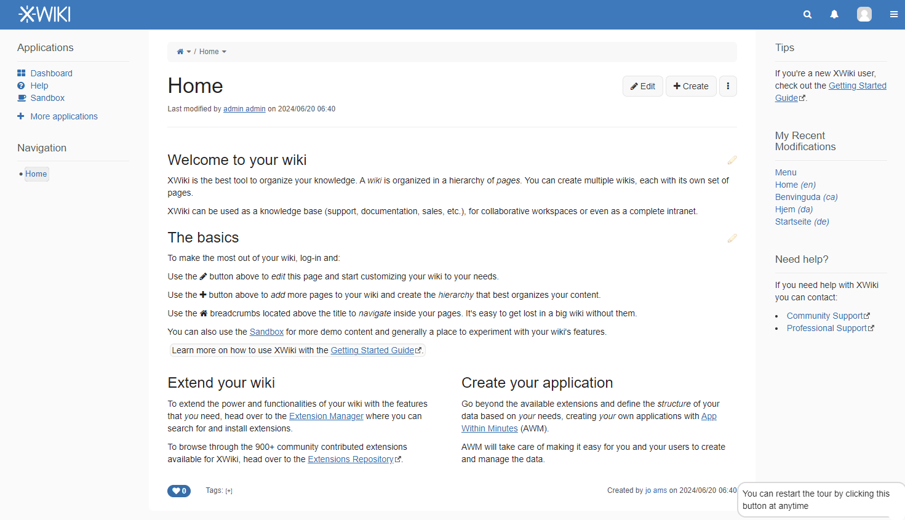

# XWiki CI/CD pipeline

Deploy XWiki server with CI/CD on Elestio

 
 

# Once deployed ...

You can open XWiki here:

    https://[CI_CD_DOMAIN]

You can open pgAdmin here:

    https://[CI_CD_DOMAIN]:63694/
    Login: [ADMIN_EMAIL]
    password: [ADMIN_PASSWORD]

# First use

On the first use, you'll have to create a new admin account.
